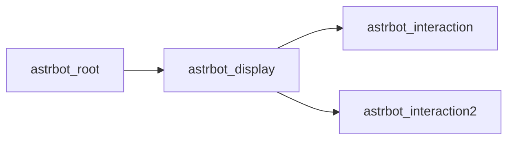

# AMR Bot

## Bot

机器人依赖骑乘绑定的实体组

其关系如下:



## Tag

|            标签            |     对象     |         描述         |
| :------------------------: | :----------: | :------------------: |
|        astrbot_root        |    根实体    |     (Root)根实体     |
|       astrbot_ground       |    根实体    |      (类型)陆地      |
|        astrbot_air         |    根实体    |      (类型)空中      |
|       astrobot_heavy       |    根实体    |      (类型)重型      |
|       astrbot_follow       |    根实体    |      (状态)跟随      |
|     astrbot_owner_temp     | 机器人持有者 |    (临时)跟随函数    |
|     astrbot_ride_temp      |    根实体    |    (临时)骑乘函数    |
|     astrbot_clear_lost     |  物品(实体)  | (临时)死亡定位掉落物 |
|        astrbot_drop        |  物品(实体)  |  (临时)机器人掉落物  |
|     astrbot_root_temp      |    根实体    |   (临时)根实体标签   |
|    astrbot_display_temp    |   展示实体   |  (临时)展示实体标签  |
|  astrbot_interaction_temp  |   交互实体   |  (临时)交互实体标签  |
| astrbot_interaction_2_temp |  交互实体2   | (临时)交互实体2标签  |

## Scoreboard

| 计分板 | 描述 |
| :----: | :--: |
|        |      |

## Storage

```NBTTree
# bot|createtable
(复合标签)astrbot:temp
├─ (复合标签)createtable
│	├─ (复合标签)item
│	│	└─ (机器人物品数据)
│	└─ (列表)lore
│		└─ (文本组件)
└─ (复合标签)summon
	└─ (机器人物品数据)
```

```NBTTree
# terminal
(复合标签)astrbot:terminal
```


## Item data

### Module

```NBTTree
(复合标签)minecraft:custom_data
└─ (复合标签)astrbot
	├─ (字符串)name: 此模块的命名空间ID。
    └─ (字符串)type: 必为module，表示此物品为一个模块。
```

